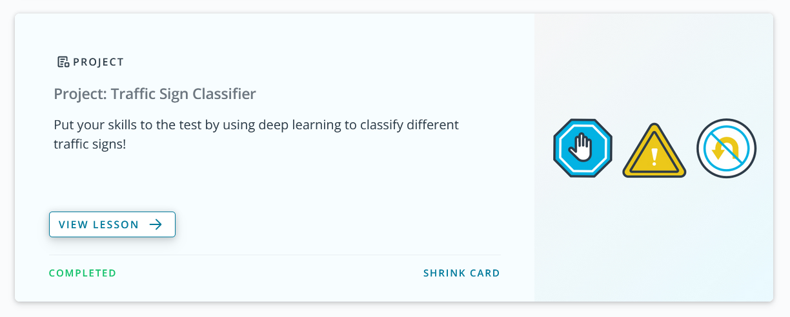

# Project: Build a Traffic Sign Recognition Program

#### Project has been implemented by YIvanov.

For original README.md file and more detailed instructions related to the general project [please, flow original udacity repository](https://github.com/udacity/CarND-Traffic-Sign-Classifier-Project/blob/master/README.md).
Detailed project description and more detailed implementation notes can be found in [this project writeup document](./writeup_YIvanov_P3.md).

### Note  
Project should be run in jupyter environment, and because of this, for simplify python notebook preview, notebook has been exported to [html document](./Traffic_Sign_Classifier_e3.html)
