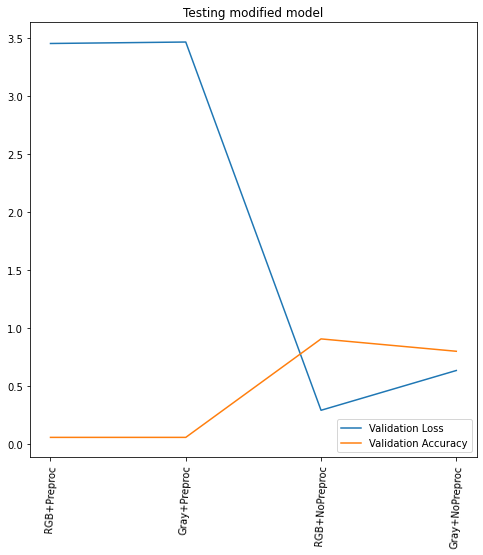

# **Traffic Sign Recognition** 

## Writeup

### by YIvanov

---

**Build a Traffic Sign Recognition Project**

The goals / steps of this project are the following:
* Load the data set (see below for links to the project data set)
* Explore, summarize and visualize the data set
* Design, train and test a model architecture
* Use the model to make predictions on new images
* Analyze the softmax probabilities of the new images
* Summarize the results with a written report


[//]: # (Image References)

[image1]: ./examples/visualization.jpg "Visualization"
[image2]: ./examples/grayscale.jpg "Grayscaling"
[image3]: ./examples/random_noise.jpg "Random Noise"
[image4]: ./examples/placeholder.png "Traffic Sign 1"
[image5]: ./examples/placeholder.png "Traffic Sign 2"
[image6]: ./examples/placeholder.png "Traffic Sign 3"
[image7]: ./examples/placeholder.png "Traffic Sign 4"
[image8]: ./examples/placeholder.png "Traffic Sign 5"


---

## Files to be submitted checklist:

* Ipython notebook with code [Traffic_Sign_Classifier_e3.ipynb](./Traffic_Sign_Classifier_e3.ipynb)
* HTML output of the code [Traffic_Sign_Classifier_e3.html](./Traffic_Sign_Classifier_e3.html)
* A writeup report [writeup_YIvanov_P3.md](./writeup_YIvanov_P3.md)

---

<!-- #region -->

## Dataset Exploration 

### Dataset Summary

I used the pandas library to calculate summary statistics of the traffic
signs data set:

| Dataset porperty         		| Value   | 
|:-----------------------------:|:-------:| 
| Number of training examples   |   34799 |
| Number of validating examples |    4410 |
| Number of testing examples    |   12630 |
| Image data shape (WxHxC)      | 32x32x3 |
| Number of classes             |      43 |


#### Exploratory Visualization

Here is an exploratory visualization of the data set. 

* Please take a look on several dataset samples shown bellow: 


This means that dataset contains images with different lightning and environmental conditions (like camera focus)

* Please also pay attention to the number of samples per catigory distribution:


As can be seen from provided diagramm some not all classes have same umber of samples. In other words provided dataset is unbalansed, this can be an issue that model will 'remeber' more frequent classes better then rare classes.  It will be better to have a datset that contain same (more or less) number of samples per class.   
<!-- #endregion -->

<!-- #region -->
 

## Design and Test a Model Architecture

### Preprocessing

In this section I've investigated preprocessing technique proposed by tensorflow library. 
* Data augmetation by adding of spesial layer proposed [here](https://www.tensorflow.org/tutorials/images/data_augmentation) like:
```
data_augmentation = tf.keras.Sequential([
  layers.experimental.preprocessing.RandomFlip("horizontal_and_vertical"),
  layers.experimental.preprocessing.RandomRotation(0.2),
])
```
Doesn't work on available version of TensorFlow

* This cause, that I'm focused on follwing preprocessing methods, please take a look following picture:


These methods are: 
* [image standartization](https://www.tensorflow.org/api_docs/python/tf/image/per_image_standardization)
* [convert to gray scale](https://www.tensorflow.org/api_docs/python/tf/image/rgb_to_grayscale)
* [gammas adjustment](https://www.tensorflow.org/api_docs/python/tf/image/adjust_gamma)
    
I've continue to test LeNet5 model with these data preprocessig approach please take a look on follwing image: 


| convert to GS | preprocessing rescaling | loss  | accuracy | 
|:-------------:|:-----------------------:|:-----:|:--------:|
| no            | yes                     | 3.4642913341522217 | 0.059382423758506775 |
| yes | yes | 3.0986886024475098 | 0.13238321244716644 |
| no | no | 0.6153956651687622 | 0.8476642966270447 |
| yes | no | 0.7782442569732666 | 0.7780680656433105 |

It looks like base model show around expected result (even little bit better) without any preprocessing of data. This cause that i've focused on model improved (see bellow) and try again same approach on modifed model: 



| convert to GS | preprocessing rescaling | loss  | accuracy | 
|:-------------:|:-----------------------:|:-----:|:--------:|
| no            | yes                     | 3.4531965255737305 | 0.059382423758506775|
| yes           | yes                     | 3.4657764434814453 | 0.059382423758506775|
| no            | no                      | 0.2928082346916199 | 0.9078384637832642|
| yes           | no                      | 0.6355993151664734 | 0.8012668490409851|

This modified model again show beste accuracy on color images with no additianla pre processing.

From tables above can bee seen that best results achieved without converting to grayscale and preprocessing rescaling ~ 85% and 91% accordingly.

Please, keep in ming that tensor flow normilise images presented by integers automatically:
```
x = np.array( [[[ 1, 0,   0],
                [ 4, 5, 127]],
               [[128,  8,   9],
                [ 10, 11, 255] ]], dtype='uint8' )    
    y = tf.image.convert_image_dtype(x, dtype=tf.float32)
```
will be converted by Tensorflow itself to:
```
tf.Tensor(
[[[0.00392157 0.         0.        ]
  [0.01568628 0.01960784 0.49803925]]

 [[0.5019608  0.03137255 0.03529412]
  [0.03921569 0.04313726 1.        ]]], shape=(2, 2, 3), dtype=float32)
```

According to this information and previously investigated accuracy (see tables above) i've decided to use following transformation:

```
   [ 0 .. 255 ] => [ 0.0 .. 1.0 ]
```
<!-- #endregion -->

### Model Architecture

I've improved base models by:
* adding 2 more convolutional layers
* adding dropouts 
* adjust dense layesrs according to the number of classes and Flatten output

My final model consisted of the following layers:

*Modified.LeNet5*

|Layer (type)                 | Output Shape             | Param # |   
|:---------------------------:|:------------------------:|:------:|
|conv2d_92 (Conv2D)           |(BS, 30, 30, 6)         |168    |      
|max_pooling2d_92 (MaxPooling |(BS, 29, 29, 6)         |0      |     
|conv2d_93 (Conv2D)           |(BS, 27, 27, 18)        |990    |    
|max_pooling2d_93 (MaxPooling |(BS, 26, 26, 18)        |0      |   
|conv2d_94 (Conv2D)           |(BS, 25, 25, 48)        |3504   |      
|max_pooling2d_94 (MaxPooling |(BS, 12, 12, 48)        |0      |   
|conv2d_95 (Conv2D)           |(BS, 11, 11, 96)        |18528  |   
|max_pooling2d_95 (MaxPooling |(BS, 5, 5, 96)          |0      |   
|flatten_29 (Flatten)         |(BS, 2400)              |0      |   
|dropout_51 (Dropout)         |(BS, 2400)              |0      |   
|dense_87 (Dense)             |(BS, 180)               |432180 |   
|dropout_52 (Dropout)         |(BS, 180)               |0      |   
|dense_88 (Dense)             |(BS, 100)               |18100  |   
|dropout_53 (Dropout)         |(BS, 100)               |0      |   
|dense_89 (Dense)             |(BS, 43)                |4343   |   
| |  | |
|Total params | | 477,813 |
|Trainable params | | 477,813 |
|Non-trainable params | | 0 | 


### Model Training

I've been used training loop (called actually model.fit) recommended by Tensorflow documentation:

* number of epochs are 60
* batch size is 196
* [optimizer is Adam](https://www.tensorflow.org/api_docs/python/tf/keras/optimizers/Adam) 
* learning rate is 0.001
* [loss is SparseCategoricalCrossentropy](https://www.tensorflow.org/api_docs/python/tf/keras/losses/SparseCategoricalCrossentropy)
* [metric is SparseCategoricalAccuracy](https://www.tensorflow.org/api_docs/python/tf/keras/metrics/SparseCategoricalAccuracy)


### Solution Approach

Finale model loss and accuracy and been presened on follwoing image:


My final model results were:
* training set accuracy of 98%
* validation set accuracy of 96% 
```
Epoch 60/60
178/178 - 1s - loss: 0.0516 - sparse_categorical_accuracy: 0.9839 - val_loss: 0.1040 - val_sparse_categorical_accuracy: 0.9692
```

* test set accuracy of 96%

```
65/65 [==============================] - 0s 3ms/step - loss: 0.1473 - sparse_categorical_accuracy: 0.9663
```


### Test a Model on New Images

#### Acquiring New Images

Here are five German traffic signs that I found on the web in [Berlin](https://www.google.com/maps/@52.5030512,13.3494911,3a,15.5y,251.44h,87.25t/data=!3m6!1e1!3m4!1s14UBnG2MfoFVUCqpK1PA1Q!2e0!7i13312!8i6656) and [Munich](https://www.google.de/maps/@48.1124572,11.5545795,3a,16.9y,320.76h,91.89t/data=!3m6!1e1!3m4!1sj5Kcd3SGxWlCU0Hq9cVjDA!2e0!7i13312!8i6656!5m1!1e3):

              

These images might be difficult to classify because are captured in real conditions by real car.


<!-- #region -->
### Performance on New Images


| Sign name |            Confidence | Predicted class id | actial class id |
|:--------------------:|:----------:|:------------------:|:----------:|
| Speed limit (30km/h)' | 100.00     | 1                  | 1
| Ahead only | 100.00 |  35 | 35 |
| Bicycles crossing | 98.53 |  29 | 29 |
| Bicycles crossing | 92.65 |  29 | 29 |
| Yield | 100.00 | 13 | 13 |
| Stop| 100.00 |  14 | 14 |
| Priority road|  100.00 | 12 | 12 |

As can bee seen from provided table model complete sure on signs that have a good representation on train/validate dataset 

Model evalution on this 'dataset' give a 100% accuracy:
```
8/8 [==============================] - 0s 2ms/step - loss: 0.0114 - sparse_categorical_accuracy: 1.0000
```
because of small number of samples. Please take a look on train set accuracy that is 96%
<!-- #endregion -->

### Model Certainty - Softmax Probabilities

Top 5 probabilities has been presented on following images: 

 

  
  
  
  
  


calculeted by: 
```
val, idx = tf.math.top_k( score, 5 )
```


### NN visualization

Layer names refferf to corresponder layer presented on model architecture. 

### input


### conv2d_92

 

### conv2d_93 

 

### conv2d_94 

 

### conv2d_95 
 

```python

```
